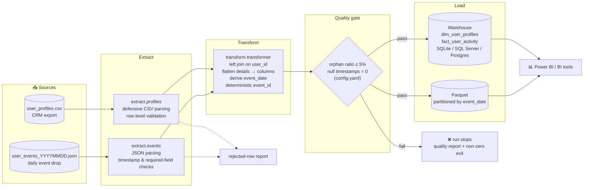
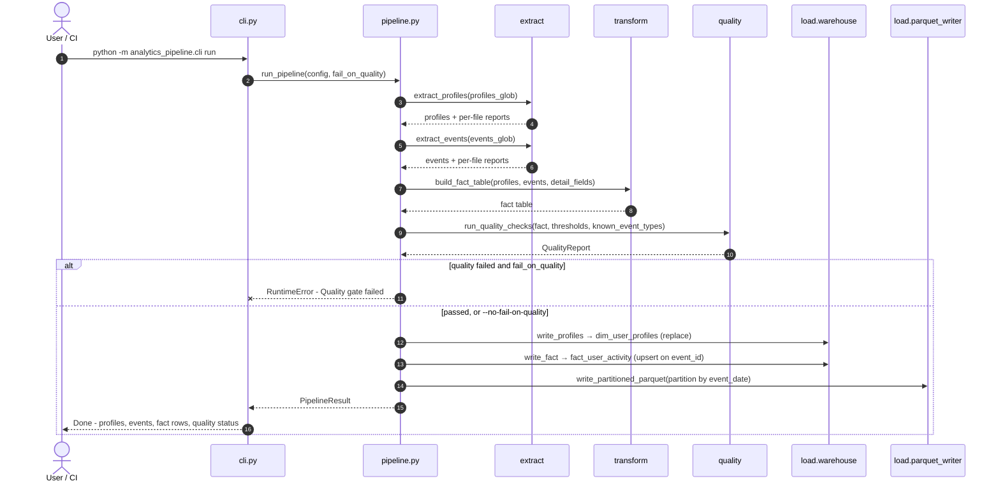
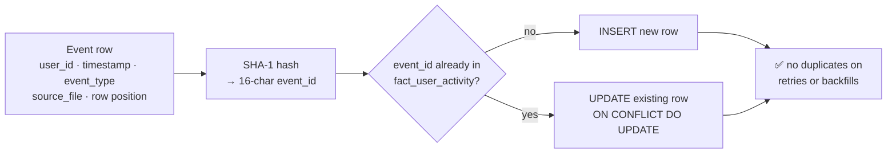
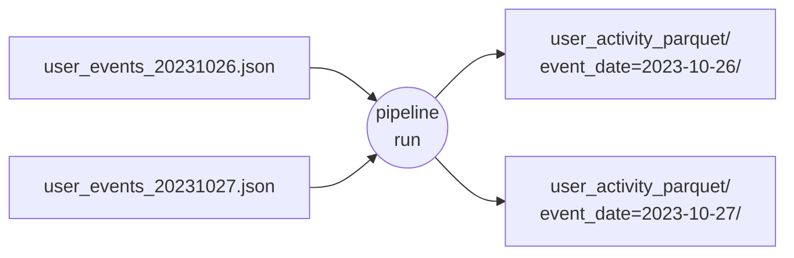
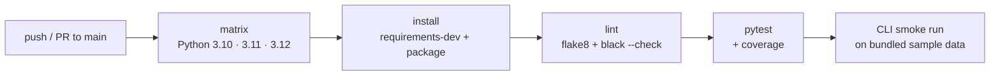
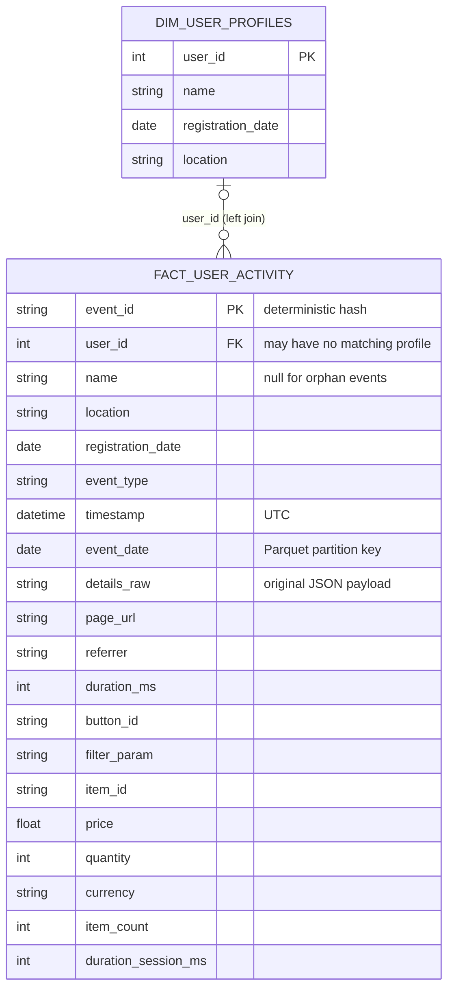

# User Analytics Data Pipeline

[](https://github.com/Milad-Shabani/User-analytics-data-pipeline/actions/workflows/ci.yml)


A small, **production-shaped** ETL pipeline that joins a slowly-changing user
profile dimension (CSV) with incremental daily user event streams (JSON)
into an analytics-ready fact table — published to both a relational
warehouse and partitioned Parquet — for product/marketing analytics and BI
dashboards (Power BI, etc.).

Built as a portfolio implementation of the problem described in
[`docs/PROBLEM_STATEMENT.md`](docs/PROBLEM_STATEMENT.md).

## Why this is more than a "read CSV, read JSON, join them" script

| Concern | How it's handled |
|---|---|
| Messy real-world CSV exports (BOM, quoted-whole-row) | `extract/profiles.py` parses defensively and reports rejected rows instead of crashing or silently dropping data |
| Events for users not (yet) in the profile dimension | Kept via a left join, not dropped — surfaced as an "orphan ratio" by the quality gate |
| Free-form, event-type-dependent `details` payload | Known fields are flattened to columns; the full original payload is kept in `details_raw` so nothing is lost |
| Re-running the pipeline over the same files | `event_id` is a deterministic hash (not a random UUID), so loads upsert instead of duplicating |
| Bad data reaching the warehouse | A configurable quality gate (`config/config.yaml`) fails the run on excessive orphan events or unparseable timestamps |
| Needing a real database to try it | Defaults to a local SQLite file (`DB_BACKEND=sqlite`); switch to SQL Server or Postgres with one environment variable |
| "Does this actually work" | Unit tests + a GitHub Actions workflow that lints, tests, and runs the CLI against the bundled sample data on every push |

## Architecture

See [`docs/ARCHITECTURE.md`](docs/ARCHITECTURE.md) for the full design
rationale.

### Pipeline flow



### What happens during a single run



### Idempotent re-runs

Because `event_id` is derived from the event itself rather than generated
randomly, processing the same file twice updates rows instead of duplicating
them (SQLite load path; SQL Server/Postgres currently append — see
*Possible next steps*).



## Quickstart

```bash
git clone https://github.com/Milad-Shabani/User-analytics-data-pipeline.git
cd User-analytics-data-pipeline
python -m venv .venv && source .venv/bin/activate
pip install -e ".[dev]" 2>/dev/null || { pip install -r requirements-dev.txt && pip install -e .; }

python -m analytics_pipeline.cli run
```

That runs the full pipeline against the bundled sample data
(`data/raw/profiles/user_profiles.csv`, `data/raw/events/user_events_20231026.json`)
using a local SQLite database — no external services required. You should
see something like:

```
Done: 5 profiles, 10 events -> 10 fact rows in 0.05s (quality PASSED)
```

Inspect the result:

```bash
python -c "import pandas as pd; print(pd.read_parquet('data/processed/user_activity_parquet').head())"
```

### Try it with more data

```bash
python scripts/generate_sample_events.py --date 2023-10-27 --events 40
python -m analytics_pipeline.cli run
```

This drops a second synthetic day of events into `data/raw/events/` and
re-runs the pipeline, producing a second `event_date=...` Parquet partition —
demonstrating the incremental, multi-day behaviour the design targets.



### Docker

```bash
docker compose up --build pipeline
```

### Point it at a real warehouse

Copy `.env.example` to `.env`, set `DB_BACKEND=mssql` (or `postgres`) and
fill in the connection details — no code changes required.

## Tests

```bash
pytest -v --cov=analytics_pipeline
```

Covers the CSV/JSON extraction edge cases, the join/flatten/event_id
transform logic, and the quality gate's pass/fail thresholds.

The same checks run in GitHub Actions on every push and pull request to `main`:



## Data model

See [`docs/DATA_DICTIONARY.md`](docs/DATA_DICTIONARY.md) for full column
definitions of `dim_user_profiles` and `fact_user_activity` — the latter is
built to be dropped straight into a Power BI model (import or DirectQuery
against the warehouse table, or via the Parquet files) as a standard
star-schema fact table.



## Possible next steps

- Swap the SQLite-specific upsert for a MERGE-based loader for SQL
  Server/Postgres targets.
- Orchestrate with Airflow/Dagster instead of a single CLI invocation,
  scheduling one run per day per new `user_events_*.json` file.
- Add a dbt layer on top of `fact_user_activity` for metric definitions
  (DAU, conversion rate, session length) shared across BI tools.

## License

MIT — see [LICENSE](LICENSE).
