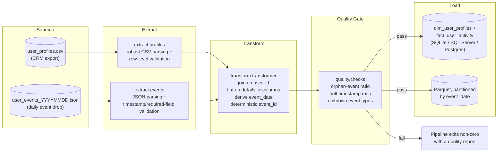

# Architecture

## Flow



## Why these choices

- **SQLAlchemy Core, not raw pyodbc.** The pipeline targets SQLite by
  default (so `git clone && make run` works with no external service) and
  SQL Server or Postgres via one environment variable
  (`DB_BACKEND=mssql|postgres`) — see `.env.example`. The pipeline code
  itself never changes.

- **Idempotency via a deterministic `event_id`.** The id is a hash of
  `(user_id, timestamp, event_type, source_file, row position)`, not a
  random UUID or an auto-increment identity. Re-running the pipeline over
  files it has already processed produces the same ids, and the SQLite load
  path upserts on that key — so backfills and retries are safe by
  construction rather than by discipline.

- **A quality gate between transform and load.** Three checks
  (`orphan_event_ratio`, `null_timestamp_ratio`, unexpected `event_type`
  values) run against every batch and can hard-fail the run via
  configurable thresholds in `config/config.yaml`. The intent is to catch a
  broken join or a bad upstream file before it reaches the warehouse, not
  to build a full data-quality framework.

- **`details_raw` alongside flattened columns.** `details` is free-form and
  event-type-dependent by design. Promoting today's known fields
  (`page_url`, `button_id`, `item_id`, ...) to real columns keeps common
  queries simple, while keeping the full original payload means a new field
  showing up in `details` tomorrow doesn't silently disappear — it's just
  not promoted yet.

- **Parquet partitioned by `event_date`.** Chosen over a single flat file so
  analytical engines can prune partitions instead of scanning everything,
  and so partitions map cleanly onto "one day of data" for
  reprocessing/backfills.

## Project layout

```
src/analytics_pipeline/
├── config.py           # config.yaml + environment variable loading
├── db.py                # SQLAlchemy engine factory (sqlite/mssql/postgres)
├── pipeline.py           # orchestrates extract -> transform -> quality -> load
├── cli.py                # `python -m analytics_pipeline.cli run`
├── extract/
│   ├── profiles.py       # CSV -> validated DataFrame
│   └── events.py         # JSON -> validated DataFrame
├── transform/
│   └── transformer.py    # join + flatten + event_id + event_date
├── quality/
│   └── checks.py         # orphan ratio / null timestamp ratio / unknown types
└── load/
    ├── warehouse.py       # dim_user_profiles + fact_user_activity (upsert)
    └── parquet_writer.py  # partitioned Parquet output
```
